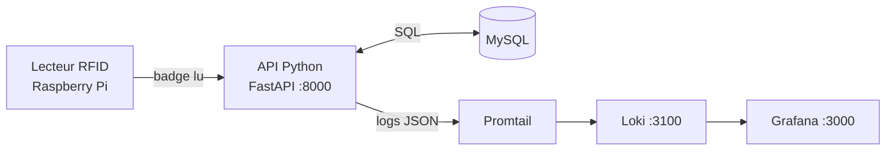

# WorkSpace 2026

Système de **contrôle d'accès par badges RFID** : gestion des badges, des rôles, des zones et des droits d'accès, avec une base MySQL, une API Python (FastAPI) et une stack d'observabilité (Loki / Promtail / Grafana).

> Projet réalisé dans le cadre du Workshop National EPSI B3 — **Horizon 2080** (Session septembre 2026).
> Groupe : `G5 · Équipe : Enzo, Tristan, Mathias

---

## Sommaire

1. [Contexte](#contexte)
2. [Architecture](#architecture)
3. [Prérequis](#prérequis)
4. [Démarrage rapide](#démarrage-rapide)
5. [Services disponibles](#services-disponibles)
6. [Structure du dépôt](#structure-du-dépôt)
7. [Base de données](#base-de-données)
8. [Observabilité : logs et dashboard](#observabilité--logs-et-dashboard)
9. [Développement local (Python)](#développement-local-python)
10. [Matériel : Raspberry Pi et lecteur RFID](#matériel--raspberry-pi-et-lecteur-rfid)
11. [Commandes utiles](#commandes-utiles)
12. [Dépannage](#dépannage)

---

## Contexte

Dans le scénario Horizon 2080, le vaisseau est un environnement isolé, sans lien temps réel avec la Terre. Il faut donc pouvoir **contrôler qui accède à quelle zone** (laboratoire, serre, systèmes vitaux, etc.) de manière autonome, fiable et traçable.

WorkSpace répond à ce besoin :

- chaque personne porte un **badge RFID** associé à un **rôle** ;
- chaque rôle donne accès à un ensemble de **zones** ;
- chaque tentative d'accès produit une **décision** (autorisée / refusée), journalisée et visible en temps réel dans Grafana.

## Architecture



| Composant | Rôle |
|---|---|
| **MySQL** | Stocke rôles, zones, badges, utilisateurs et droits d'accès |
| **API Python** | Expose les routes et prend les décisions d'accès |
| **Promtail** | Collecte les logs JSON des conteneurs Docker |
| **Loki** | Indexe et stocke les logs |
| **Grafana** | Dashboard des décisions d'accès et de l'activité HTTP |
| **Raspberry Pi** | Support matériel du lecteur RFID |

## Prérequis

- [Docker](https://docs.docker.com/get-docker/) et Docker Compose
- Python 3 (pour le lancement local et le générateur de logs)
- Un Raspberry Pi avec lecteur RFID (uniquement pour la partie matérielle)

## Démarrage rapide

### 1. Configurer l'environnement

Depuis la racine du projet :

```bash
cp .env.example .env
```

Éditer `.env` et **remplacer au minimum les mots de passe de démonstration** :

- `MYSQL_ROOT_PASSWORD`
- `MYSQL_PASSWORD`
- `GRAFANA_ADMIN_PASSWORD`

> Les valeurs utilisées par l'API, MySQL et Grafana doivent rester cohérentes entre elles.

### 2. Lancer la stack

```bash
docker compose --env-file .env -f docker-compose.yml up -d --build
```

### 3. Vérifier l'état des services

```bash
docker compose ps
```

- `workspace-mysql` doit être **`healthy`** (patienter si nécessaire) ;
- `workspace-api`, `workspace-loki`, `workspace-promtail` et `workspace-grafana` doivent être démarrés.

Au premier démarrage, MySQL exécute automatiquement :

1. `jeux_de_donnees/commandes.sql` → création du schéma ;
2. `jeux_de_donnees/test_donnees.sql` → insertion des données de démonstration.

### 4. (Optionnel) Injecter des logs de test

```bash
python3 jeux_de_donnees/generate_test_logs.py
```

### 5. Arrêter les services

```bash
docker compose --env-file .env down
```

> Si Loki, Promtail ou Grafana ne sont pas nécessaires temporairement, leurs blocs peuvent être commentés dans `docker-compose.yml`.

## Services disponibles

| Service | URL |
|---|---|
| API | http://localhost:8000 |
| Documentation API (Swagger) | http://localhost:8000/docs |
| Loki (état) | http://localhost:3100/ready |
| Grafana | http://localhost:3000 |
| Dashboard RFID | http://localhost:3000/d/rfid-access/rfid-controle-des-acces |

**Identifiants Grafana (développement)** : `GRAFANA_ADMIN_USER` / `GRAFANA_ADMIN_PASSWORD`, définis dans `.env`.

## Structure du dépôt

> Vue non exhaustive, centrée sur les éléments clés.

```text
.
├── app/                          # API Python (point d'entrée : app/main.py)
├── hardware/                     # Code du Raspberry Pi (ex. test_rfid.py)
├── jeux_de_donnees/
│   ├── commandes.sql             # Création des tables et contraintes
│   ├── test_donnees.sql          # Jeu de données de démonstration
│   └── generate_test_logs.py     # Générateur de logs synthétiques (Loki)
├── docker-compose.yml
├── .env.example
└── requirements.txt
```

## Base de données

### Modèle

Tables : `role`, `badge`, `user`, `zone`, `location`, `access_zone`.

Règles d'identifiants :

| Entité | Format d'identifiant |
|---|---|
| Badge, Rôle | Entier positif de **exactement 12 chiffres** (`100000000000` à `999999999999`) |
| Utilisateur, Zone | UUID textuel |

Le format à 12 chiffres est contrôlé à trois niveaux : la **base**, l'**ORM** et les **paramètres de l'API**.

### Initialisation automatique

Les deux scripts SQL sont montés dans `/docker-entrypoint-initdb.d/` et ne s'exécutent **qu'une seule fois**, à la création du volume `mysql_data`.

> ⚠️ Toute modification des fichiers SQL après un premier lancement nécessite de [réinitialiser la base](#réinitialiser-la-base-développement-uniquement) pour être prise en compte. Un simple `docker compose up -d` conserve les données existantes et ne rejoue pas les scripts.

### Vérifier que les données sont chargées

```bash
docker exec -it workspace-mysql mysql -u root -p
```

```sql
SHOW DATABASES;
USE <nom_de_la_base>;   -- valeur de MYSQL_DATABASE dans .env
SHOW TABLES;
SELECT * FROM role;
SELECT * FROM zone;
SELECT * FROM badge;
SELECT * FROM user;
SELECT * FROM access_zone;
SELECT * FROM location;
```

Droits d'accès par utilisateur (jointure complète) :

```sql
SELECT
    u.name, u.surname, r.name AS role, z.name AS zone_autorisee
FROM user u
JOIN badge b ON u.badge_id = b.id
JOIN role r ON b.role_id = r.id
JOIN access_zone za ON za.role_id = r.id
JOIN zone z ON za.zone_id = z.id
ORDER BY u.surname, z.name;
```

### Importer un autre jeu de données

Pour tester un jeu de données personnel **sans modifier les fichiers du projet** :

1. Créer un fichier SQL dans `jeux_de_donnees/`, par exemple `jeux_de_donnees/mon_jeu.sql`.
2. Y placer les `INSERT` dans l'ordre : `role`, `zone`, `badge`, `user`, `access_zone`, puis `location`.
3. Utiliser des identifiants respectant les contraintes du schéma et **absents** de la base.
4. Importer le fichier dans le conteneur :

```bash
docker compose --env-file .env up -d mysql
docker compose --env-file .env exec -T mysql \
    sh -c 'mysql -u"$MYSQL_USER" -p"$MYSQL_PASSWORD" "$MYSQL_DATABASE"' \
    < jeux_de_donnees/mon_jeu.sql
```

La commande utilise les identifiants de `.env`, quel que soit le nom de la base. Elle **n'efface pas** les données existantes : pour un import reproductible, utiliser de nouveaux identifiants ou réinitialiser la base avant l'import.

Vérification par comptage :

```bash
docker compose --env-file .env exec -T mysql \
    sh -c 'mysql -u"$MYSQL_USER" -p"$MYSQL_PASSWORD" "$MYSQL_DATABASE" \
    -e "SELECT COUNT(*) AS roles FROM role; SELECT COUNT(*) AS zones FROM zone; \
    SELECT COUNT(*) AS badges FROM badge; SELECT COUNT(*) AS utilisateurs FROM user;"'
```

Pour **remplacer complètement** le jeu de démonstration : modifier `jeux_de_donnees/test_donnees.sql`, puis réinitialiser la base (section suivante).

### Réinitialiser la base (développement uniquement)

> ⚠️ `down -v` supprime les volumes Docker : **base MySQL, logs Loki et données Grafana**. À ne jamais utiliser sur un environnement contenant des données à conserver.

```bash
docker compose --env-file .env -f docker-compose.yml down -v
docker compose --env-file .env -f docker-compose.yml up -d --build
docker compose ps        # attendre que workspace-mysql soit "healthy"
```

Relancer ensuite le générateur de logs si nécessaire :

```bash
python3 jeux_de_donnees/generate_test_logs.py
```

## Observabilité : logs et dashboard

### Pipeline de logs

Les logs de l'API sont écrits en **JSON sur la sortie standard**. Promtail les détecte depuis les conteneurs Docker et les envoie à Loki avec les labels :

`service` · `container` · `level` · `event`

Les événements `http_request` et `access_decision` sont directement interrogeables dans Loki. Grafana utilise Loki comme source de données, configurée automatiquement.

### Dashboard « RFID - Controle des acces »

Provisionné automatiquement avec la datasource Loki. Il affiche :

- les logs de l'API ;
- les décisions d'accès ;
- le nombre d'accès **refusés** et **autorisés** sur la période ;
- l'activité des requêtes HTTP dans le temps.

Période par défaut : `Last 24 hours` · Rafraîchissement : toutes les 10 secondes.

### Générer des logs de test

Les logs synthétiques ne sont **pas** chargés par MySQL. Une fois Loki démarré :

```bash
python3 jeux_de_donnees/generate_test_logs.py
```

Le script injecte **20 décisions d'accès** réparties sur les dernières 24 h (15 refus, 5 autorisations). Il peut être relancé pour ajouter un nouveau jeu de logs.

## Développement local (Python)

Créer l'environnement virtuel et installer les dépendances :

```bash
python3 -m venv .venv
source .venv/bin/activate
python3 -m pip install -r requirements.txt
```

Lancer l'API en local (une base MySQL doit être accessible) :

```bash
source .venv/bin/activate
uvicorn app.main:app --reload
```

Variables d'environnement requises :

| Variable | Description |
|---|---|
| `DB_USER` | Utilisateur MySQL |
| `DB_PASSWORD` | Mot de passe MySQL |
| `DB_HOST` | Hôte MySQL |
| `DB_PORT` | Port MySQL |
| `DB_NAME` | Nom de la base |

## Matériel : Raspberry Pi et lecteur RFID

| Paramètre | Valeur |
|---|---|
| Nom d'hôte | `pi` |
| Utilisateur | `admin` |
| Mot de passe | _voir l'équipe (ne jamais le committer)_ |

Connexion :

```bash
ping pi.local
ssh admin@pi.local
```

Une fois connecté sur le Raspberry Pi :

```bash
# Activer l'environnement virtuel
source hardware/.venv/bin/activate

# Lancer le programme de test du lecteur RFID
python hardware/test_rfid.py
```

## Commandes utiles

| Action | Commande |
|---|---|
| Démarrer la stack | `docker compose --env-file .env -f docker-compose.yml up -d --build` |
| État des services | `docker compose ps` |
| Logs de l'API | `docker compose logs -f api` |
| Arrêter (données conservées) | `docker compose --env-file .env down` |
| Tout réinitialiser (données supprimées) | `docker compose --env-file .env down -v` |
| Shell MySQL | `docker exec -it workspace-mysql mysql -u root -p` |
| Générer des logs de test | `python3 jeux_de_donnees/generate_test_logs.py` |
| Lancer l'API en local | `uvicorn app.main:app --reload` |

## Dépannage

| Problème | Piste de résolution |
|---|---|
| `workspace-mysql` n'est pas `healthy` | Patienter, puis consulter `docker compose logs mysql`. Vérifier la cohérence des mots de passe dans `.env`. |
| Les données SQL modifiées ne sont pas prises en compte | Les scripts ne s'exécutent qu'à la création du volume : [réinitialiser la base](#réinitialiser-la-base-développement-uniquement). |
| Le dashboard Grafana est vide | Vérifier que Loki répond sur `http://localhost:3100/ready`, puis lancer `generate_test_logs.py` et élargir la période affichée. |
| Erreur d'identifiant de badge/rôle | Les identifiants doivent comporter exactement 12 chiffres (`100000000000` à `999999999999`). |
| `pi.local` injoignable | Vérifier que le Raspberry Pi et le poste sont sur le même réseau, puis réessayer le `ping`. |
